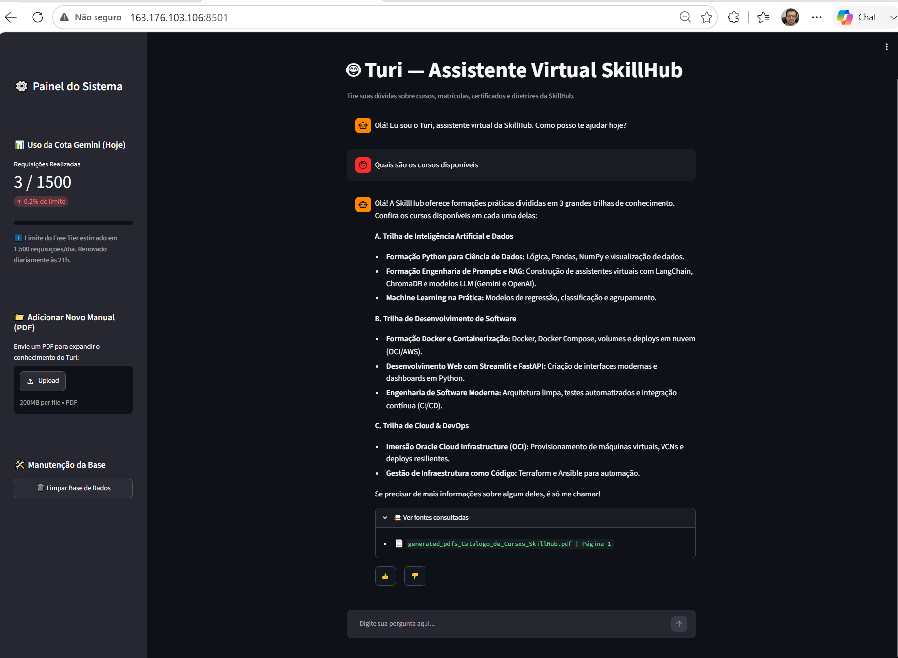
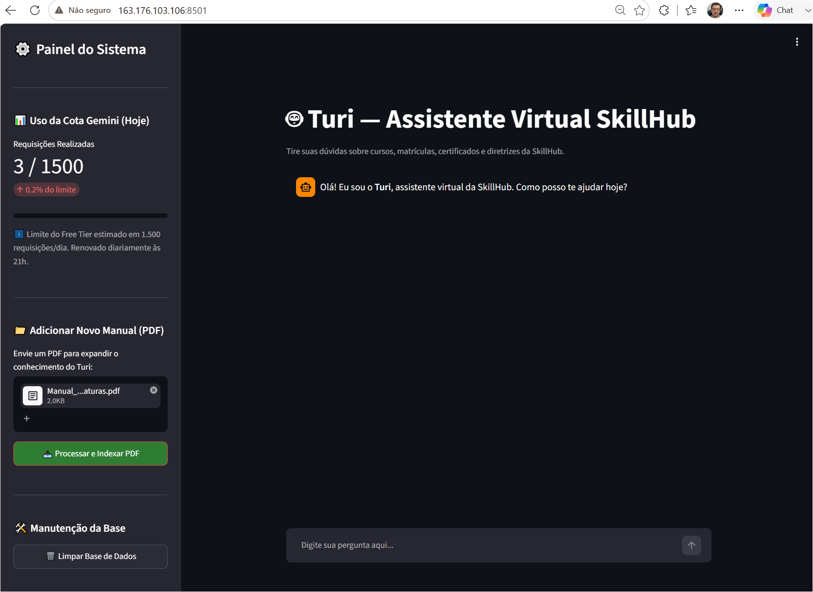

# 🤖 Turi - Assistente Virtual Inteligente (RAG) | Challenge Alura + Oracle (ONE)

O **Turi** é um agente inteligente desenvolvido com arquitetura **RAG (Retrieval-Augmented Generation)** capaz de responder a dúvidas sobre catálogos de cursos, planos de assinatura e políticas internas a partir do processamento de manuais e documentos em PDF.

---

## 🚀 Evidência de Deploy na Oracle Cloud Infrastructure (OCI)

A aplicação foi implantada com sucesso e está operando em uma Instância VM Linux na nuvem da Oracle.

* **☁️ Infraestrutura:** Oracle Cloud Infrastructure (OCI) via Docker Containers.
* **🌐 Aplicação em Produção:** [http://163.176.103.106:8501](http://163.176.103.106:8501)
---

## 🏛️ Arquitetura da Solução

1. **Ingestão e Processamento:** Leitura e fragmentação (*chunking*) de documentos PDF inseridos na interface.
2. **Armazenamento Vetorial:** Indexação do conhecimento na base vetorial para busca semântica rápida.
3. **Recuperação e Geração:** Recuperação de contexto relevante e geração de respostas estruturadas utilizando a API do **Google Gemini**.
4. **Interface Visual:** Painel interativo construído em **Streamlit** com rastreamento de cotas de uso da API e indicação transparente das fontes consultadas.

---

## 🛠️ Tecnologias e Ferramentas Utilizadas

* **Linguagem:** Python 3.11+
* **Framework Web & UI:** Streamlit
* **Modelo de Linguagem (LLM):** Google Gemini API
* **Containerização:** Docker & Docker Compose
* **Cloud Platform:** Oracle Cloud Infrastructure (OCI)

---

## 💡 Exemplos de Uso do Agente

### ❓ Perguntas Frequentes
* *"Quais são os cursos disponíveis?"*
* *"Como funciona a política de cancelamento e reembolso?"*
* *"Quais são os planos e assinaturas disponíveis?"*

### 💬 Exemplo de Resposta Gerada pelo Turi



### 💬 Exemplo de upload de pdf para a base do Turi


---

## 💻 Instruções para Executar o Projeto Localmente

### Pré-requisitos
* Docker e Docker Compose instalados
* Chave de API do Google Gemini (`GEMINI_API_KEY`)

### Passos de Execução

1. Clone o repositório:
   ```bash
   git clone https://github.com/joaobcandido/skillhub-turi-rag.git
   ```
2. Crie um arquivo .env na raiz do projeto contendo a sua chave da API do Gemini:
   ```bash
   GEMINI_API_KEY='sua_chave_aqui'
   ```
3. Subir a aplicação com Docker Compose:
   ```bash
   cd skillhub-turi-rag
   docker compose up --build -d
   
4. Acesse a aplicação no navegador:
   ```
   http://localhost:8501
   ```

### 📄 Geração do PDF Base de Conhecimento

O repositório já inclui um script para gerar automaticamente os PDFs com o conhecimento inicial do assistente (Catálogo de Cursos, Planos e Políticas).

Para criar ou atualizar os arquivos PDF na raiz do projeto, execute:

```bash
python generate_pdfs.py
```
